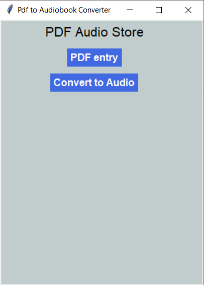

# Pdf-to-Audiobook-Converter [](https://forthebadge.com)

<br>
A Pdf to Audiobook Converter GUI App Made Using Python 3.9.0 .
Hope You Will Like It and you can also use the code to make your own version.

## Requirements
1.  gTTS
2.  pdfplumber
3.  tkinter

---

### Installing The gTTS Module:
* For Linux: Open Terminal then type ```pip3 install gTTS```
* For Windows: Open CMD, then type ```pip install gTTS```

### Installing The pdfplumber Module:
* For Linux: Open Terminal then type ```pip3 install pdfplumber```
* For Windows: Open CMD, then type ```pip install pdfplumber```

---
## Demo

